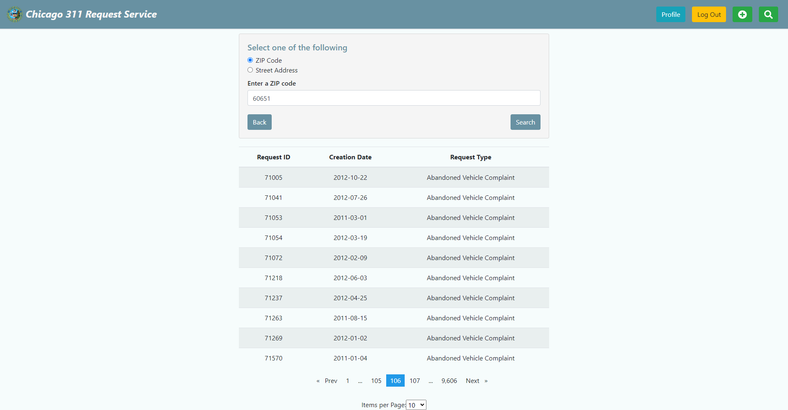
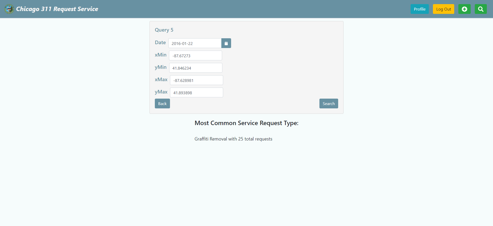
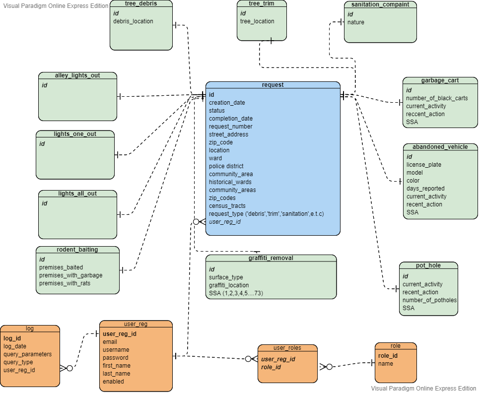

# 311 Chicago Service Application 

## About the project

This project is part of the _Database-Management-Systems_ course. Our main goal is to implement a database solution to manage _311
Incidents_ data openly published by the city of Chicago. 
Data are stored in a relational database designed carefully for handling both simple and more complex queries effectively.
We also provide a web application, that allows authenticated users to perform queries against the data stored in our database.
It consists of an Angular application and a REST API service implemented with Spring.


## Built with


* 
* 
* 
* 
* 

## Getting Started

* Download dataset from [Kaggle](https://www.kaggle.com/datasets/chicago/chicago-311-service-requests)
* Create database with name _311CI_
* Run [parser.py](parser/parser.py) to parse and clean the data
* Run [import.py](parser/import.py) to import the data into the database


## Usage

1. Install npm dependencies listed in package.json
    ```
    npm install
    ```
2. Start Angular application
   ```
   npm start
   ```
3. Start Spring Boot Application 
   ```
   mvn spring-boot:run
   ```
4. Open your browser at `http://localhost:4200/ `

You should be able to see the following landing page:


After having successfully authenticated, you should be able to run queries against the database. The screenshots below 
illustrate the interface of our application.





## Implementation

### Database Schema

The main idea behind the schema implementation is to follow an OOP approach. As, we can see from the tables, there are 11 
different request types,  all of them sharing many common fields. As a result, 
we have a main "central" table called _request_ and 1:1 associations to the other tables. It is like creating 
a main request class and adding fields based on the request type, we want to extend. We also have a _user_reg_ table which 
has an M:N association with the _role_ table. Note that each user can have multiple roles.


An important thing to mention is that we've put the request type inside the request table. For normalization purposes 
we could make an extra table, store the 11 unique values there and create an 1:N association. We followed this approach because 
many queries are based on request type thus we wanted to speed things up and avoid extra joins. Moreover, the same 
thing was done for SSA with values ranging from 1 to 71. Lastly, for the logs we used a 1:N association with the user. 
_log_ table stores information about the timestamp, query type and query parameters. 



### Indexes
We experimented with various queries as well as indexes on different columns of our tables. 
We mainly experimented with BTree. It is worth mentioning that in many cases indexes did not make our queries faster. 
Starting off with the first query, there was no noticeable difference between the two executions (1.8 ms with and without index). 
On the other hand, when we executed the second query having created an index on _request_type_ column, 
we saw an impressive gain on execution time of about 400ms (500ms -> 90ms). Additionally, 
we tried to build a hash table on _request_type_ column but building time took forever due to collisions, as we only have 11 different request types.

Both on query 4 and query 5 we did not gain any speedup despite trying with an index on _creation_date_ as well as with 
and index on a composite column consisting of _longitude_ and _latitude_. Same applies for query 6.
It is worth pointing out that we noticed a small difference on query 7 after having constructed a BTree index on the _licence_plate_
column, namely we went from 110ms to 90ms. On query 8 we did not gain any speedup. As for queries 9,19 
& 11 we only noticed a very small change with BTree index on _premises_baited_ , _premises_with_garbage_ and _premises_with_rats_ respectively.
Lastly, there was no significant gain on query 12. 
However, we should note that, using SQL's _in_ operator instead of joining tables, execution time was increased by 400ms.

[Here](img/metrics) you can find screenshots regarding query execution time.


Queries implemented in this project can be found in [queries.sql](sql/queries.sql)

### Contact
- [George Panagiotopoulos](https://github.com/giorgospan)
- [George Michas](https://github.com/geooo109)
- Project link: [https://github.com/giorgospan/Database-Management-Systems-Project-I](https://github.com/giorgospan/Database-Management-Systems-Project-I)


 


